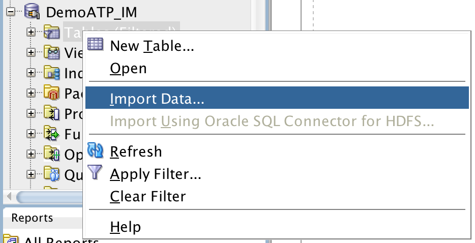
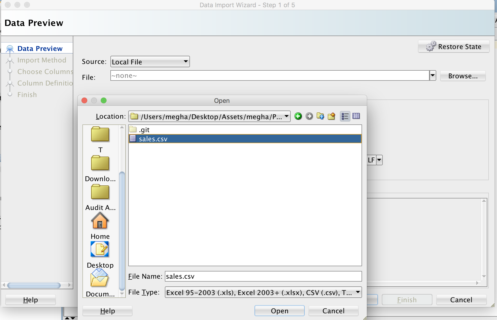

Updated - June 5, 2019 

By Megha Gajbhiye

# Exporting from tables in Autonomous Database to text file in Object Storage using Threads.

## Objectives
	
In this lab we will be exporting data from AUtonomous Database to a text file in object storage. 
This script demonstrates the use of threads with cx_Oracle. A session pool is used so that multiple connections are available to perform work on the database. 
Only one operation (such as an execute or fetch) can take place at a time on a connection. 
In the below example, one of the threads performs dbms_lock.sleep while the other performs a query. 

## Required Artifacts

- The following lab requires an Oracle Public Cloud account with Autonomous Data Warehouse Cloud Service.

- You need to have a connection to database in SQL Developer through admin. 

    - Open up your SQL Developer and create a new connection for admin. If you already have a connection, skip this step. 

    - Enter the following details for admin:

        1.	Connection Name: DemoATP
        2.	Username: admin
        3.	Password: Password you entered while creating database on cloud.
        4.	Connection Type: Cloud PDB
        5.	Configuration File: Path to your wallet
        6.	Keystore Password: Password entered while downloading wallet. 

        

    - Click on Test, if it shows success, click on save and then click on connect. 
 
 - This script requires Python to be configured in your environment. 
 
 - This script requires cx_Oracle version 2.5 or higher. 
    
    Please download it using the following command on your Terminal .    
    "**python -m pip install cx_Oracle --upgrade**" . 
 
### **Step 1**: Download the Script

- Clone the script to your desktop. [PythonExportThreadADWC.py](PythonExportThreadADWC.py)

### **Step 2**: Create SALES table in Autonomous Database.

- You need to have a connection to database through SQL Developer.
    1.	Connection Name: give any name
    2.	Username: enter your username.
    3.	Password: enter database password
    4.	Connection Type: Cloud PDB
    5.	Configuration File: Path to your autonomous database wallet
    6.	Keystore Password: Password entered while downloading wallet. 

  

- Click on Test, if it shows success, click on save and then click on connect. 

- Download the csv file. [sales.csv](sales.csv)

- Upload data from the following csv file in your autonomous database.

    1. Right click on **table** and then **import data**.

        
        
    2. Leave the source as **Local File**, click on Browse and select the downloaded csv file.
    
        
        
    3. Click on next till you reach the review page and click on finish. Table is created and the data is loaded.
    
- Create Object Store Bucket and a swift URL for the bucket:

    1. Open the navigation menu. Under Core Infrastructure, click Object Storage.

    2. A list of the buckets in the compartment you're viewing is displayed. If you don’t see the one you're looking for, verify that you’re viewing the correct compartment (select from the list on the left side of the page).

    3. Select a compartment from the Compartment list on the left side of the page.

       A list of existing buckets is displayed.

    4. Click Create Bucket.
       In the Create Bucket dialog box, specify the attributes of the bucket:

       **Bucket Name**: The system generates a default bucket name that reflects the current year, month, day, and time, for example bucket-20190306-1359. If you change this default to any other bucket name, use letters, numbers, dashes, underscores, and periods. Do not include any confidential information.
       **Storage Tier**: Select the tier in which you want to store your data. Available tiers include:

       Standard is the primary, default Object Storage tier for storing frequently accessed data that requires fast and immediate access.
       Archive is a special tier for storing infrequently accessed data that requires long retention periods. Access to data in the Archive tier is not immediate. You must restore archived data before it’s accessible. For more information, see Overview of Archive Storage.
 
       **Encryption**: Buckets are encrypted with keys managed by Oracle by default, but you can optionally encrypt the data in this bucket using your own Key Management encryption key. To use Key Management for your encryption needs, select Encrypt Using Customer-Managed Keys. Then, select the Vault Compartment and Vault that contain the master encryption key you want to use. Also select the Master Encryption Key Compartment and Master Encryption Key. For more information about encryption, see Overview of Key Management. For details on how to create a vault, see Managing Vaults.

       **Tags**:Optionally, you can apply tags. If you have permissions to create a resource, you also have permissions to apply free-form tags to that resource. To apply a defined tag, you must have permissions to use the tag namespace. For more information about tagging, see Resource Tags. If you are not sure if you should apply tags, skip this option (you can apply tags later) or ask your administrator.

     5. Click Create Bucket.
    
        
### **Step 3**: Configure your environment.

- Change the following parameters in this part of the script:

  **pool = cx_Oracle.SessionPool("Username", "Password","Service_Name", 2, 5, 1, threaded = True)**
  
  1. Username: your username
  2. Password: Password you entered while creating database on cloud.
  3. Service_Name : Your Service Name

- Change the following parameters in this part of the script:

  **for c in (select * from table_name WHERE ROWNUM <= 10)**
  
  **loop**
    
    **utl_file.put_line(p_file, c.column_name );**
  
  1. **table_name** : Your Table name. Since we have uploaded "sales.csv", we will change this to "sales". 
     
     Code should look like: 
     
     **for c in (select * from sales WHERE ROWNUM <= 10)**
     
  2. **column_name** : Your Column name
  
     We will give one of the column of sales table, which is "cust_id".
     
     Code should look like:
     
     **utl_file.put_line(p_file, c.cust_id );**
     
 
- Change the following parameter in this part of the script:

  **dbms_cloud.put_object(**
  	 **'OBJ_STORE_CRED',** 
	 **'swift URL to Object Storage/test_file.txt',**
	 **'DATA_PUMP_DIR',**
	 **'test_file.txt' );**
  
  
 -  **OBJ_STORE_CRED**
      
     Make sure that you create object storage credential with the name "OBJ_STORE_CRED".
     
     Here is the procedure:
     
  	1. Create Auth token: Follow the following link to create auth token: https://www.oracle.com/webfolder/technetwork/tutorials/obe/cloud/adwc/OBE_Loading%20Your%20Data/loading_your_data.html#CreateanObjectStoreAuthToken
     
  
  	2. Create Object Storage credential:
	
	  Follow the following link to create object storage credential:
			https://www.oracle.com/webfolder/technetwork/tutorials/obe/cloud/adwc/OBE_Loading%20Your%20Data/loading_your_data.html#CreateObjectStoreCredentialsinyourAutonomousDataWarehouseSchema

 	
 -  **swift URL to Object Storage**: Change this to swift URL of your Object Storage

### **Step 4**: Run the script.

 - Now run the script. Go to your Terminal and type the following command: 
 
   "**python PythonExportThreadADWC.py**" 
 
   Navigate to your object storage and you should see test_file.txt file with all your data.
